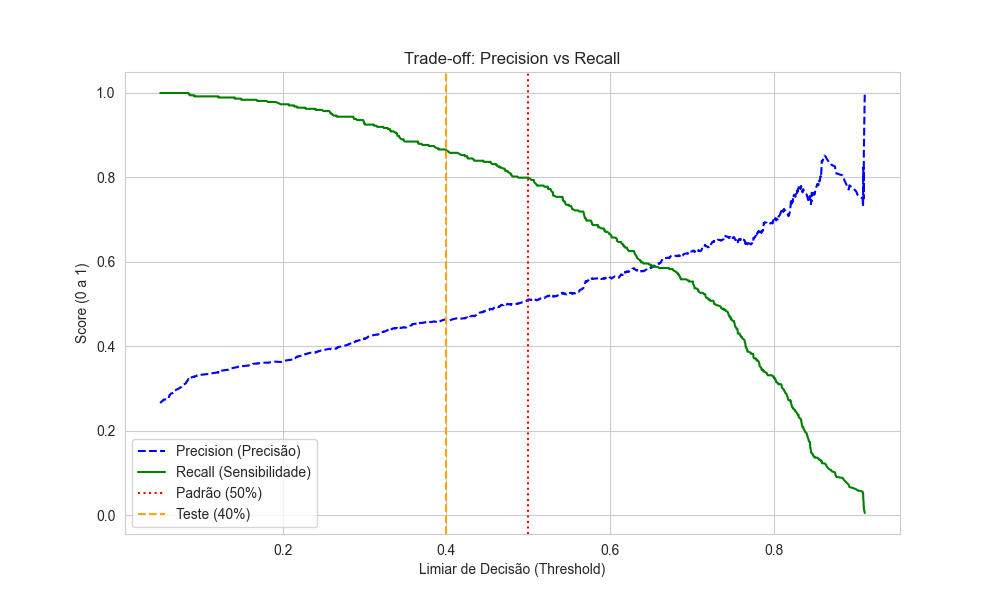

# 📉 Telco Churn Prediction: Retenção Estratégica & Business Analytics


---

## 1. O Contexto de Negócio
No setor de telecomunicações, é consenso de mercado que o custo para adquirir um novo cliente (CAC) é significativamente maior do que para manter um atual. Portanto, a retenção deixa de ser apenas uma métrica operacional e passa a ser uma alavanca financeira crítica para sustentabilidade do negócio.

**Fonte de Dados:**    
Este projeto utiliza a base pública Telco Customer Churn, disponibilizada no Kaggle, amplamente utilizada como benchmark em problemas de churn. Os dados foram ingeridos manualmente em um banco SQLite para      simular um ambiente real de dados.
🔗 https://www.kaggle.com/datasets/blastchar/telco-customer-churn

**O Problema:**
A empresa analisada enfrenta um cenário de **"Cegueira Operacional"**:
* Existe uma taxa de cancelamento visível, mas as causas raíz não são claras.
* A equipe de ponta (Customer Success) atua de forma **reativa**, tentando reter clientes apenas quando o pedido de cancelamento já foi feito.
* Falta priorização: não há distinção clara entre quem é um cliente seguro e quem está prestes a sair.

**A Missão:** Construir uma solução de dados que permita à empresa sair da postura reativa e antecipar clientes com maior risco de churn.

---

## 2. Objetivos do Projeto
Este projeto simula um cenário real de consultoria de dados com os seguintes entregáveis:
1.  **Diagnosticar:** Mapear os padrões comportamentais e contratuais que precedem o churn.
2.  **Prever:** Utilizar Machine Learning para antecipar a probabilidade de saída de cada cliente.
3.  **Operacionalizar:** Entregar ferramentas para que a gestão possa tomar decisões baseadas em dados, e não em intuição.  
>  **Nota**  
> Durante o desenvolvimento, diferentes abordagens de modelagem foram testadas e descartadas por não atenderem ao objetivo principal de maximizar recall sem perder interpretabilidade. As decisões técnicas foram guiadas tanto por métricas quanto por aplicabilidade real no negócio.

---

## 3. Soluções & Entregáveis
O projeto foi estruturado para atender diferentes níveis da organização (Estratégico e Tático):

### 3.1. Diagnóstico Financeiro e de Risco
Através da análise de dados, quantificamos o problema:
* **Taxa de Churn:** Identificamos uma taxa de **26,54%**, confirmando a urgência de ação.
* **Receita em Risco:** Na amostra validada, detectamos **~R$28.529,00** em receita recorrente prestes a ser perdida.
* **Performance do Modelo:** O modelo final (Regressão Logística) atingiu um recall de ~80%, priorizando a identificação da maior parte dos clientes em risco.
  
> **Nota**
> O modelo identificou como principais fatores de churn o tipo de contrato, a forma de pagamento e o uso de fibra óptica. Essas variáveis são apresentadas de forma operacional no dashboard para priorização de ações.

**Trade-off Precision vs Recall**  
Para minimizar a perda de clientes, o modelo foi calibrado priorizando **recall**, aceitando um aumento controlado de falsos positivos. A escolha do ponto de corte considerou o custo de errar ao não identificar um cliente prestes a cancelar.


*Análise de trade-off utilizada para definição do ponto de corte do modelo.*


### 3.2. Visão Executiva (Apresentação)
Material focado na visão estratégica e no impacto financeiro, ideal para apresentações de diretoria.
> **[📄 Clique aqui para acessar a Apresentação Executiva (.pdf)](presentation/apresentacao_ppt.pdf)**

### 3.3. Ferramenta Tática (Power BI)
Para a equipe operacional, desenvolvemos um painel interativo. O foco é a **"Lista de Ataque"**: filtrar os Top 50 clientes com maior risco para abordagem imediata.


*(O arquivo editável .pbix encontra-se na pasta `/dashboard`)*

### 3.4. Business Analytics (SQL)
Antes da modelagem, utilizamos SQL para validar hipóteses de negócio diretamente na fonte. Abaixo estão as perguntas estratégicas respondidas (scripts disponíveis em `/sql`):

* **Priorização de Receita:** *"Quais clientes de alto valor (Ticket Médio acima da média) têm alta probabilidade de saída?"*
* **Volatilidade Contratual:** *"Qual tipo de contrato apresenta a maior taxa de evasão?"*
* **Jornada do Cliente:** *"O risco de churn é maior nos primeiros 6 meses (Onboarding) ou em clientes antigos?"*
* **Sangramento Financeiro:** *"Qual produto/serviço específico gera a maior perda de receita absoluta?"*
* **Estratégia de Lock-in:** *"A venda de serviços adicionais (Upsell) funciona como barreira de saída?"*

---

## 4. Ferramentas
Utilizamos uma abordagem *End-to-End* profissional:

| Categoria | Tecnologias Utilizadas |
| :--- | :--- |
| **Engenharia de Dados** | **SQL (SQLite)** para extração e validação; **Pandas** para manipulação. |
| **Machine Learning** | **Scikit-learn** & **XGBoost**; Técnicas de **SMOTE** (balanceamento) e Feature Engineering. |
| **Visualização** | **Power BI** (Dashboard Interativo) e **Matplotlib/Seaborn** (Gráficos estáticos). |
| **Negócios** | **Storytelling** e Apresentação Executiva (PPT/PDF). |

---

## 5. Estrutura do Repositório
```text
├── assets/              # Recursos visuais (Prints e Gráficos)
├── dashboard/           # Arquivo Power BI (.pbix)
├── data/                # Bases de dados
├── models/              # Modelos preditivos serializados (.pkl)
├── notebooks/           # Desenvolvimento (EDA, ML, Feature Engineering)
├── presentation/        # Apresentação Executiva (.pdf)
├── sql/                 # Scripts de Business Analytics
└── README.md            # Documentação
```
----

## 6. Como Executar o Projeto

Este projeto foi estruturado para simular um pipeline real de dados.  
O banco de dados SQLite **não é versionado** e é gerado automaticamente via script de ingestão.

### Passo 0 — Clonar o repositório
```bash
git clone https://github.com/JCarapina/projeto-churn-telecom.git
cd projeto-churn-telecom
```
### Passo 1 — Criar o ambiente
```bash
python -m venv .venv
source .venv/bin/activate  # Windows: .venv\Scripts\activate
pip install -r requirements.txt
```

### Passo 2 - Gerar banco de dados
```bash
python src/01_ingestao_etl.py
```


